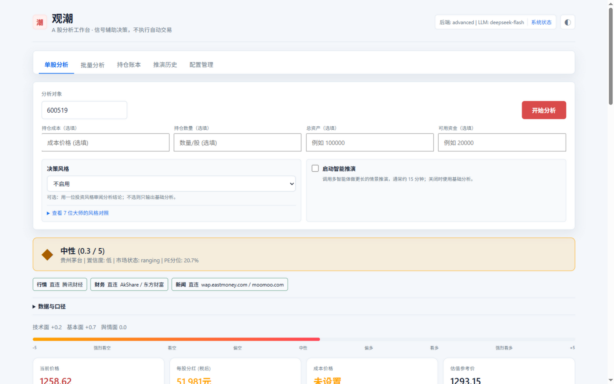
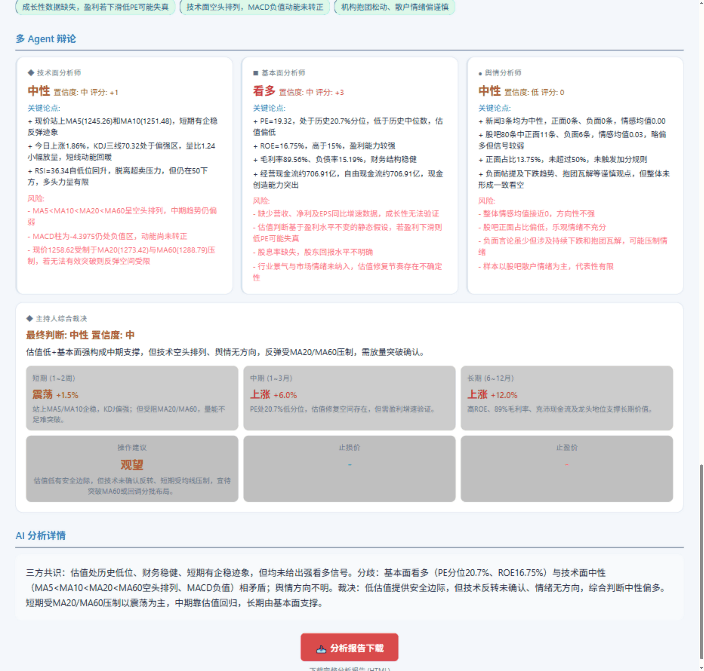
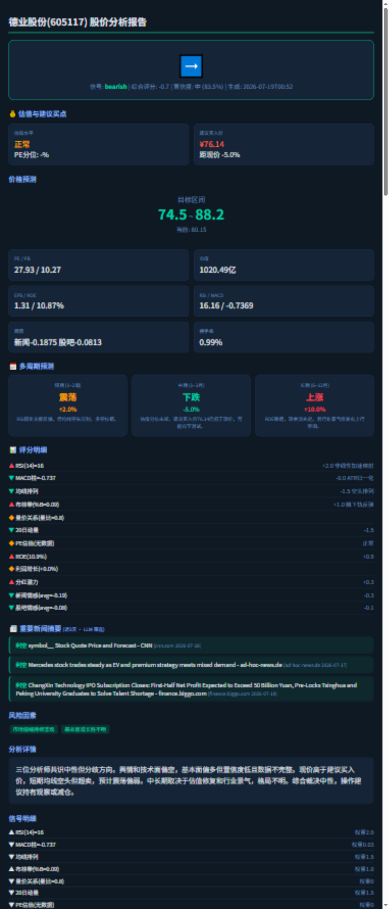
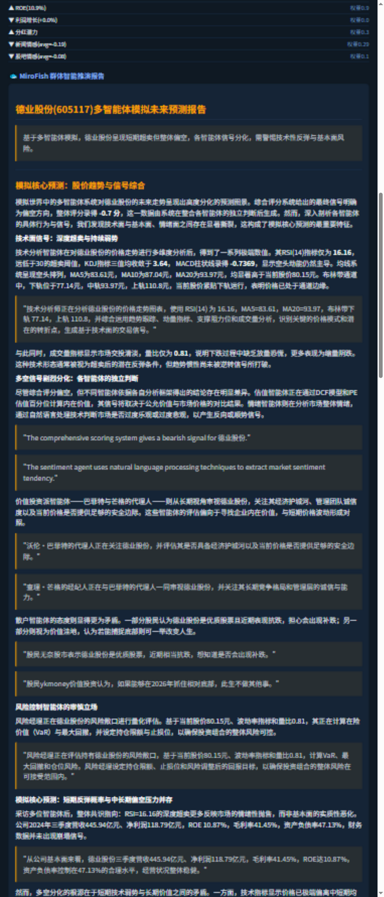
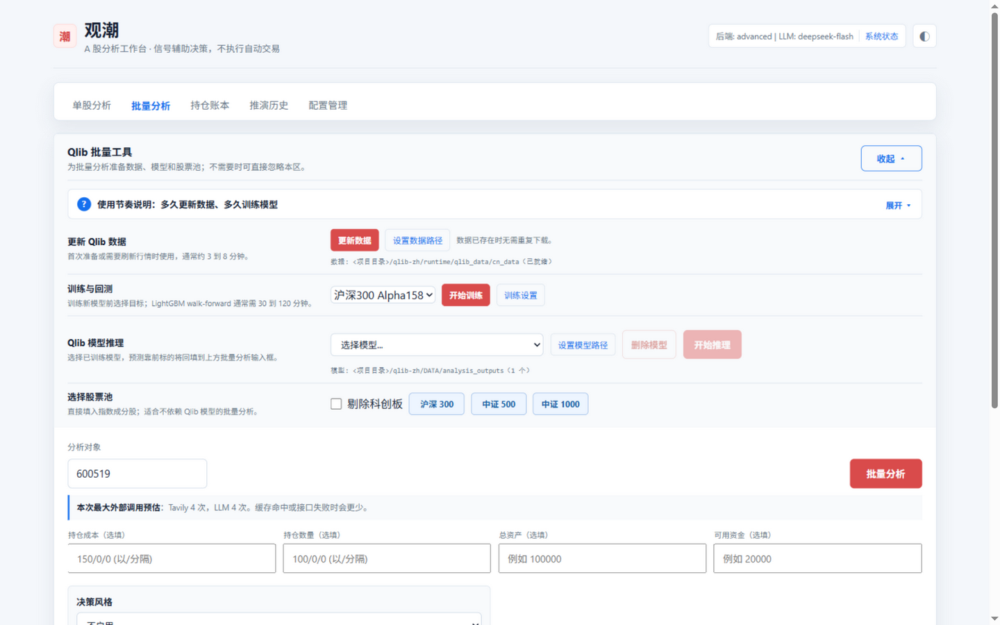
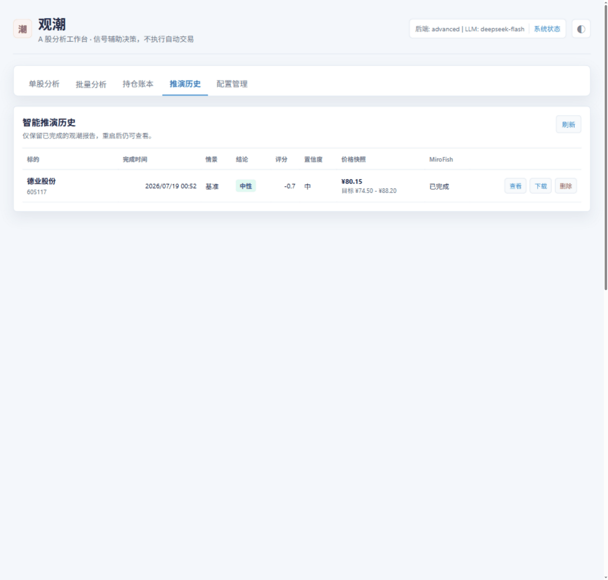
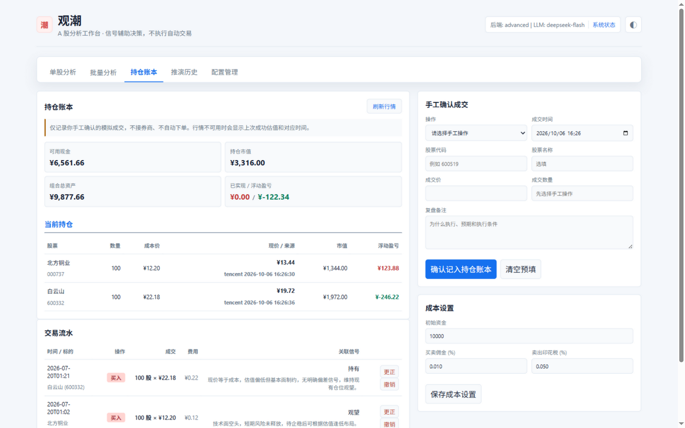
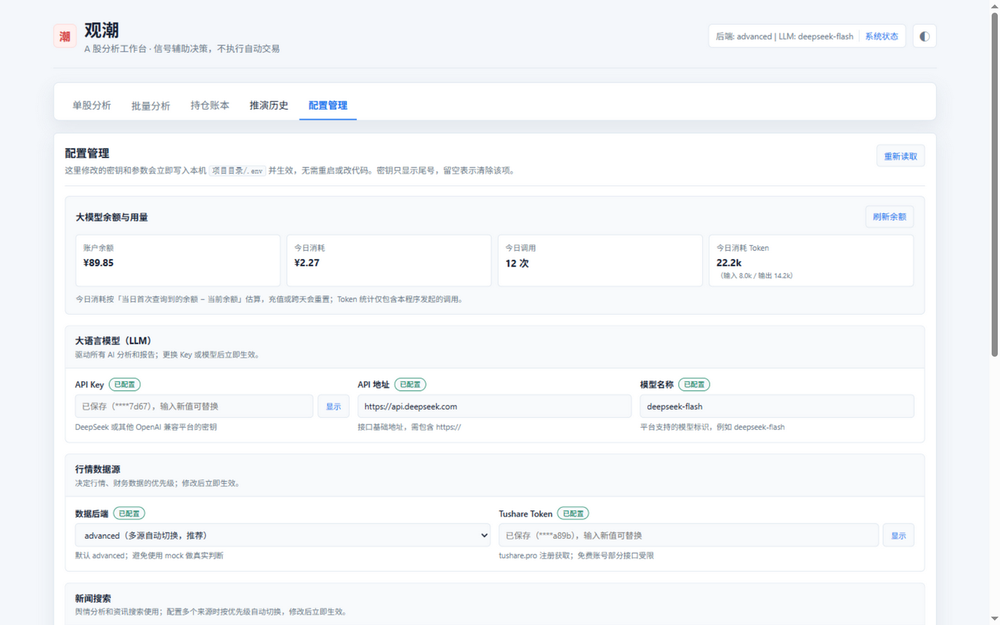

# 观潮 Guanchao

**面向 A 股的本地智能研究工作台。** 行情、财务、舆情、多智能体辩论、机器学习选股、情景推演，一个页面全部打通；所有数据留在本机，不连接券商、不自动下单。

> 不是玩具演示，而是一套认真做的系统：数据有溯源、结论有护栏、回测有质量面板、交易有账本复盘。

[English README](README_EN.md) · [上游与许可](#上游与许可)



## 特色能力

### 多 Agent 辩论 + 决策风格
一只股票由技术面、基本面、舆情三个 Agent 独立分析，再经主持人综合裁决；可选巴菲特、格雷厄姆、林奇等 **7 位投资大师**的投资框架审阅结论。结论自动过“决策护栏”：信号矛盾降级观望、无持仓禁给加减仓、行情不可用一律不产生买卖建议。



### 智能推演报告（深色主题）

开启「智能推演」后，系统会调用多智能体群体模拟，为标的生成一份**独立的深色主题报告页面**：信号总览、估值与建议买点、价格预测区间、多周期预测、评分明细、重要新闻摘要、风险因素，以及完整的 **MiroFish 群体智能推演报告**（模拟核心预测、各智能体行为与决策逻辑、散户辩论、风险控制立场等）。

演示报告（德业股份 605117，2026-07-19 推演）：





> 完整示例页面见 [`docs/report-sample.html`](docs/report-sample.html)：下载到本地用浏览器打开，可看到全部章节与完整推演内容。

### 数据溯源，口径透明
行情、财务、新闻每一项都标注**数据来源、抓取时间、报告期和口径**；数据降级、使用备用源或缓存时会明确显示状态，绝不拿模拟数据冒充真实行情。

### Qlib 机器学习选股
内置完整 Qlib 工作流：一键更新 A 股全市场数据 → LightGBM walk-forward 滚动训练 → 查看逐折样本外回测质量（收益、夏普、回撤、IC、胜率、稳定性）→ 推理生成高分候选回填批量分析。沪深 300 / 中证 500 双股票池，训练一次、长期使用。



### 批量分析（并发加速）
支持自选列表与主流指数股票池，默认 5 路并发（可配置），带最大外部调用预估，逐只进度实时推送，结果按输入顺序汇总排名。

### MiroFish 情景推演
对重点标的启动多智能体群体推演：模拟不同角色在市场中的互动，生成情景化长报告；推演历史本地留存，随时回看。



### 持仓账本与复盘闭环
手工确认的模拟成交账本：记录买卖价、费用、关联的分析快照和信号理由；区分真实/过期行情，逐笔重算持仓与盈亏，支持撤销与更正并保留完整痕迹。



### 配置管理，不用碰代码
页面内管理所有 API 密钥和运行参数，改动立即生效无需重启；**大模型余额与今日消耗**实时可见；密钥只显示尾号。



### 本地优先，隐私安全
所有数据默认落盘本机并在 `.gitignore` 中排除：分析快照、账本数据库、Qlib 数据模型、推演原始文件均不会被上传。服务默认只绑定 `127.0.0.1`。

## 快速开始（Windows + Conda）

前提：已安装 Git、Conda 和 Python 3.11。

```powershell
git clone https://github.com/You-lie/a-share-research-workbench.git
Set-Location stock-fish
Copy-Item .env.example .env

conda create -n stock_quant python=3.11 -y
conda run -n stock_quant python -m pip install -r requirements.txt
conda run -n stock_quant python -m pip install -r MiroFish/backend/requirements.txt
```

编辑 `.env`，至少填入可用的 `LLM_API_KEY`（Tushare、Tavily、Zep 按需填写），然后启动：

```powershell
conda run -n stock_quant python app.py
```

打开 `http://127.0.0.1:8000`。本地 `MIROFISH_AUTO_START=true` 时，观潮会自动启动 MiroFish，无需另开终端。

## 配置要点

| 变量 | 用途 | 是否必需 |
| --- | --- | --- |
| `LLM_API_KEY` | 深度分析、决策风格和 MiroFish 推演 | 使用这些功能时必需 |
| `TUSHARE_TOKEN` | 更完整的 A 股基础与财务数据 | 推荐 |
| `TAVILY_API_KEY` | 新闻搜索与摘要 | 推荐 |
| `ZEP_API_KEY` | MiroFish 图记忆 | 可选 |
| `STOCK_BACKEND` | `advanced`、`tushare`、`akshare` 或 `mock` | 推荐 `advanced` |
| `QLIB_PYTHON` | 独立 Qlib Conda 环境的 Python 路径 | 使用 Qlib 时必需 |

以上均可在页面「配置管理」中修改。不要提交 `.env`，也不要在 Issue、截图或日志中粘贴密钥。

## Qlib（可选）

Qlib 使用独立环境，避免与主服务和 MiroFish 依赖混在一起：

```powershell
conda create -n stock_qlib python=3.11 -y
conda run -n stock_qlib python -m pip install pyqlib lightgbm mlflow
```

在 `.env` 中填写该环境 Python 的绝对路径：

```env
QLIB_PYTHON=C:\path\to\conda\envs\stock_qlib\python.exe
```

启动后在「批量分析 → Qlib 批量工具」中按面板顶部的使用节奏说明操作：

1. **更新数据**：每个交易日收盘后更新一次（首次数分钟）。
2. **训练模型**：每月一次即可，每个股票池各训一个模型。
3. **推理选股**：日常只需选择已有模型推理，高分候选自动回填批量分析。

## 本地数据与隐私

下列目录由程序自动创建并已被 `.gitignore` 排除，不会上传到 GitHub：

| 路径 | 内容 |
| --- | --- |
| `data/paper_portfolio.db` | 持仓账本的交易、设置和行情快照 |
| `memory/analysis/` | 单股深度分析 JSON 快照 |
| `data/outputs/reports/` | 智能推演 HTML / JSON 报告与历史入口 |
| `memory/stocks/`、`memory/cache/data/` | 本地行情、新闻、财务缓存 |
| `qlib-zh/runtime/`、`qlib-zh/DATA/` | Qlib 数据、MLflow 记录、模型与训练产物 |
| `MiroFish/backend/uploads/` | MiroFish 项目、报告、日志和模拟过程文件 |

更换电脑时，复制这些目录即可带走全部历史记录。

## 目录概览

```text
stock-fish/
├── app.py                    # 观潮启动入口和 Flask API
├── static/index.html         # 分析前端
├── analysis/                 # 分析、决策护栏、批量流程与用量统计
├── market_data/              # 行情、财务、新闻和数据溯源
├── paper_portfolio.py        # 本地 SQLite 持仓账本
├── prediction_report/        # 智能推演报告生成
├── simulation_bridge/        # 观潮到 MiroFish 的桥接
├── MiroFish/backend/         # 本地群体智能推演服务
├── qlib-zh/                  # Qlib 数据、训练、推理与回测集成
├── settings_manager.py       # 页面配置管理（.env 热更新）
└── data/                     # 本地运行数据，默认不提交
```

## 使用边界

- 本项目仅用于研究与辅助决策，不连接券商，也不会自动下单。
- 数据可能延迟、缺失或来自备用来源；请以数据溯源面板显示的口径和时间为准。
- Qlib 回测、LLM 结论和情景推演均不代表未来或实盘收益。

## 上游与许可

本项目是在开源项目 [freenowill/stock-fish](https://github.com/freenowill/stock-fish) 基础上的二次开发版本，运行方式、数据安全、Qlib 本地工作流、数据溯源、持仓账本、配置管理与推演历史等均为本项目重新设计实现。

- 上游 StockFish 版权声明：`Copyright (c) 2026 freenowill`（MIT），原文保留在 [NOTICE.md](NOTICE.md)。
- 集成组件：[MiroFish](https://github.com/666ghj/MiroFish)（AGPL-3.0）、[Microsoft Qlib](https://github.com/microsoft/qlib)、[AkShare](https://github.com/akfamily/akshare)、[Tushare](https://tushare.pro)。

本项目采用 [GNU Affero General Public License v3.0](LICENSE)（AGPL-3.0）开源。请在使用、修改或再分发时遵守相应许可证条款并保留原始版权与通知。
